# Part 1 – User Management

## 1. Create a New User

### Command

```bash

sudo useradd testuser

```

### Description

I can create an user account named testuser. This is how I add an user to my system.

### Screenshot

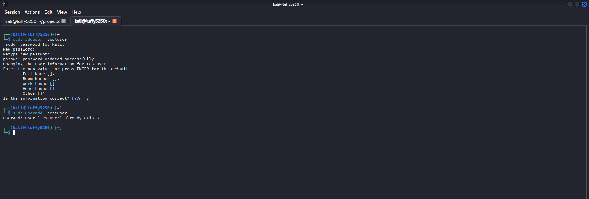

---

## 2. Set a Password for the User

### Command

```bash

sudo passwd testuser

```

### Description

I need to set a password for testuser. This is how I set or change the password for the testuser user account.

### Screenshot

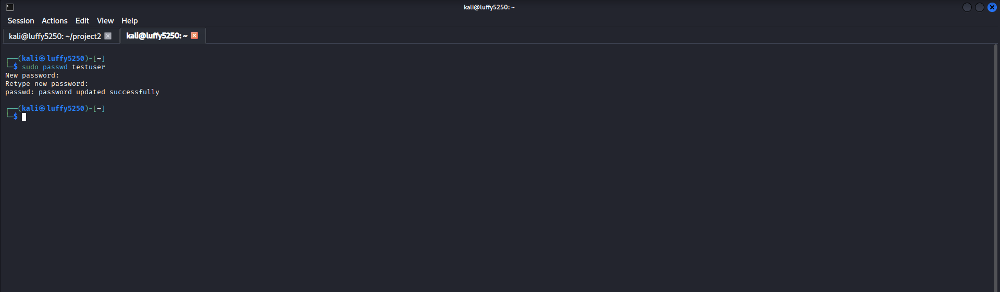

---

## 3. Modify User Information

### Command

```bash

sudo usermod -c "Test User" testuser

```

### Description

I can. Update the comment, which is the full name for the testuser user account. This is how I modify user information for testuser.

### Screenshot

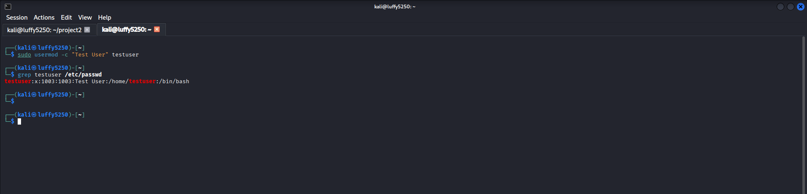

---

## 4. Check Password Status

### Command

```bash

sudo passwd -S testuser

```

### Description

I want to know the password status of testuser. This command helps me see the password status of the testuser user account.

### Screenshot

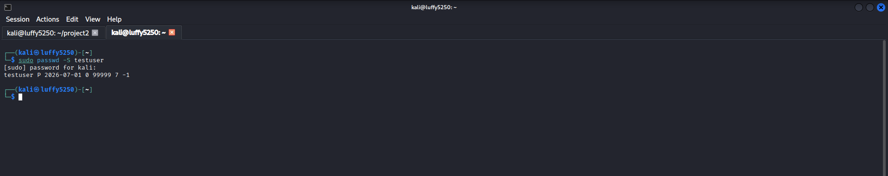

---

## 5. Display Password Aging Information

### Command

```bash

sudo chage -l testuser

```

### Description

I need to see password aging and account expiration information for testuser. This command shows me the password aging and account expiration information for the testuser user account.

### Screenshot

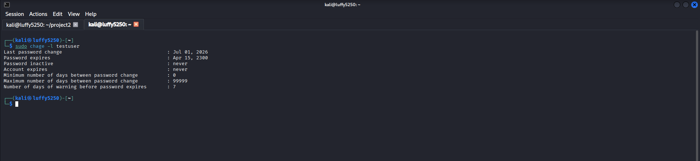

---

## 6. View Last Login Information

### Command

```bash

lastlog2

```

### Description

I want to see the login information for all users, including testuser. This command displays the login information for all users.

### Screenshot


---

## 7. Lock a User Account

### Command

```bash

sudo passwd -l testuser

```

### Description

Sometimes I need to lock the testuser user account. This command locks the testuser user account.

### Screenshot

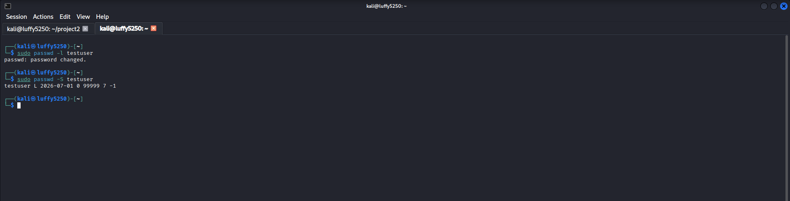

---

## 8. Unlock a User Account

### Command

```bash

sudo passwd -u testuser

```

### Description

If I locked the testuser user account I can unlock it using this command. This command unlocks the testuser user account.

### Screenshot

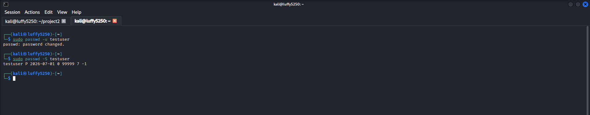

---

## 9. Delete a User Account

### Command

```bash

sudo userdel testuser

```

### Description

If I do not need the testuser user account anymore I can delete it. This command deletes the testuser user account.

### Screenshot

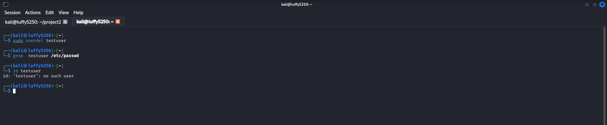

---

## 10. Delete User and Home Directory

### Command

```bash

sudo userdel -r testuser

```

### Description

I can also delete the testuser user account and its home directory. This command deletes the testuser user account and its home directory.

lt text](screenshots/userdel.png)

---
### Screenshot

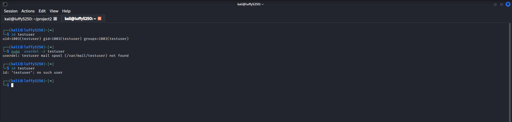

---
# Conclusion

In this part, I learned how to:

- Create a new user using `useradd`.
- Set a user password using `passwd`.
- Modify user information using `usermod`.
- Check password status using `passwd -S`.
- Display password aging information using `chage`.
- View last login details using `lastlog`.
- Lock a user account using `passwd -l`.
- Unlock a user account using `passwd -u`.
- Delete a user using `userdel`.
- Delete a user and its home directory using `userdel -r`.

-------------------------------------------------------------------------------------------------------------------------------------------------------------------------------------------------


# Part 2 – Group Management

## 1. Create a New Group

### Command

```bash

sudo groupadd developers

```

### Description

I create a group called developers.

### Screenshot

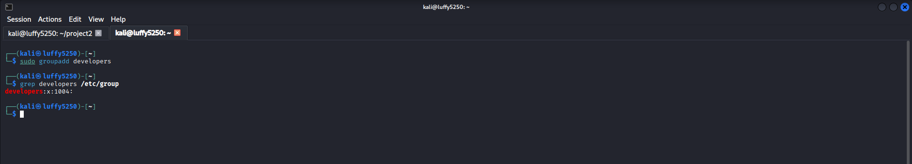

## 2. Display Group Information

### Command

```bash

getent group developers

```

### Description

This command shows details about the developers group.

### Screenshot

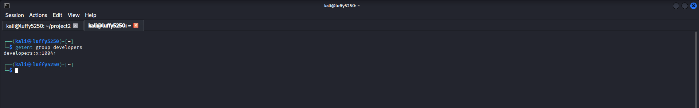

## 3. Rename a Group

### Command

```bash

sudo groupmod -n security developers

```

### Description

The developers group is renamed to security.

### Screenshot

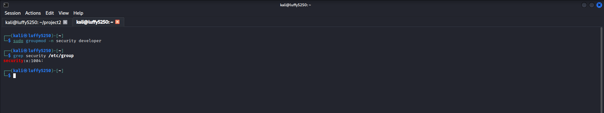

## 4. Add a User to a Group

### Command

```bash

sudo gpasswd -a testuser security

```

### Description

I add testuser to the security group.

### Screenshot

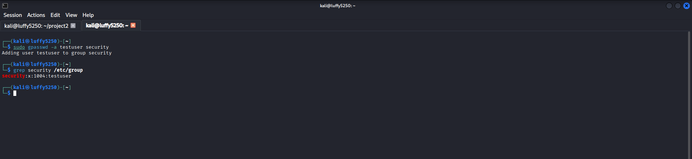

## 5. Remove a User from a Group

### Command

```bash

sudo gpasswd -d testuser security

```

### Description

The testuser is removed from the security group.

### Screenshot

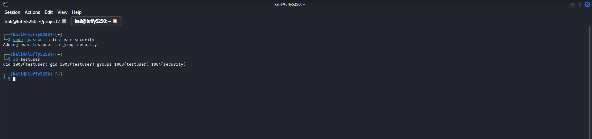

## 6. Switch to a New Group

### Command

```bash

sudo gpasswd -a testuser security

```

### Description

My current session switches to the security group.

### Screenshot

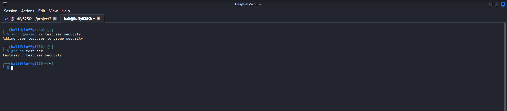

## 7. View All Groups

### Command

```bash

cat /etc/group

```

### Description

This shows all groups on my system.

### Screenshot

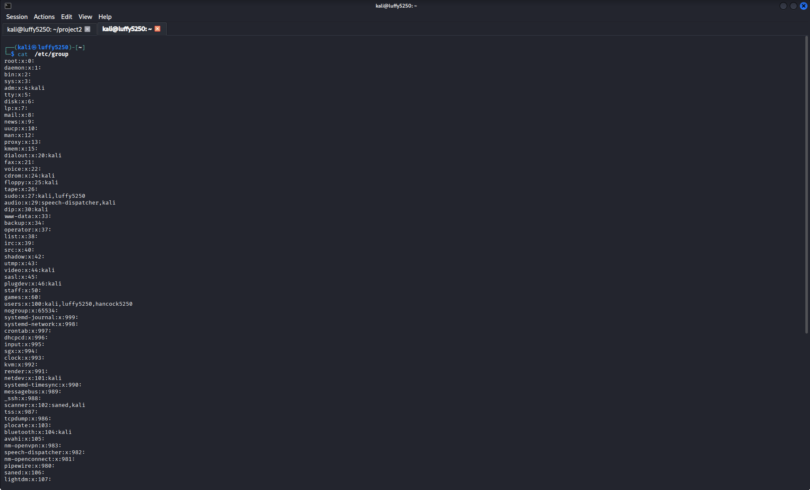

## 8. Display Members of a Group

### Command

```bash

getent group security

```

### Description

The members of the security group are displayed.

### Screenshot

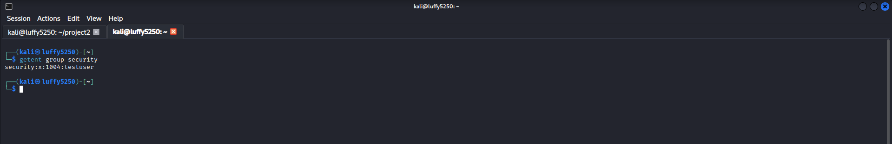
## 9. Delete a Group

### Command

```bash

sudo groupdel security

```

### Description

The security group is deleted.

### Screenshot

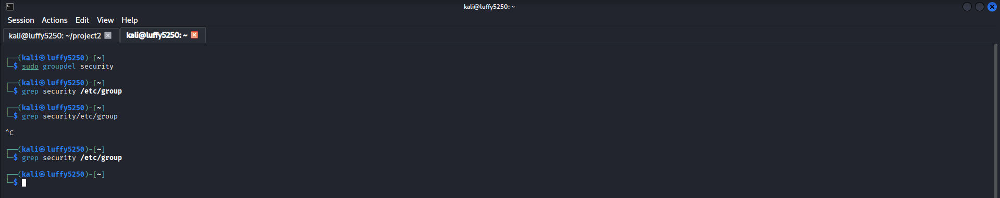

## 10. Verify Group Deletion

### Command

```bash

getent group security

```

### Description

I check if the security group still exists.

### Screenshot

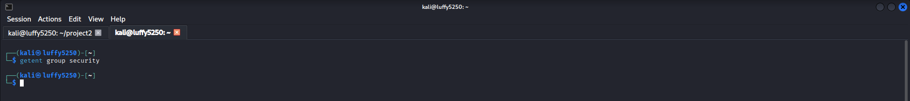

# conclusion

In this part here is what I learned:

- I can create a group with `groupadd`.

- `getent group` helps me view group information.

- I rename a group using `groupmod`.

- To add a user to a group I use `gpasswd -a`.

- ` -d` removes a user from a group.

- `newgrp` switches my current session to another group.

- All system groups are shown with `cat /etc/group`.

- Group members are displayed using `getent group`.

- I delete a group, with `groupdel`.

- Finally I verify group deletion using `getent group`.


--------------------------------------------------------------------------------------------------------------------------------------------------------------------------------------------------------------------------------------


# Part 3 – File Ownership & Advanced Permissions

## 1. Change File Owner

### Command

```bash

sudo chown testuser sample.txt

```

### Description

I can change the owner of sample.txt to testuser. This is how I do it. I use the command chown to change the owner of the file sample.txt to testuser.

### Screenshot

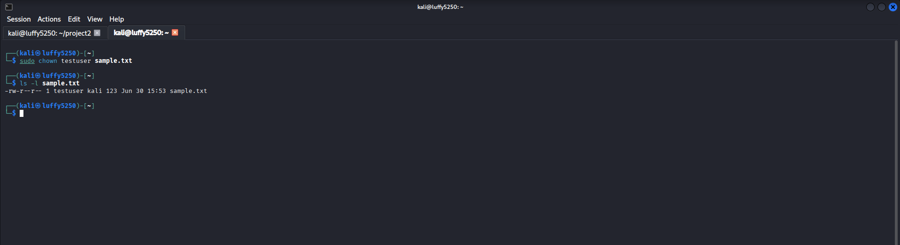

---

## 2. Change Owner and Group

### Command

```bash

sudo chown testuser:security sample.txt

```

### Description

I can change both the owner and the group of the file sample.txt. This is how I do it. I use the command chown to change the owner and group of sample.txt to testuser and security.

### Screenshot

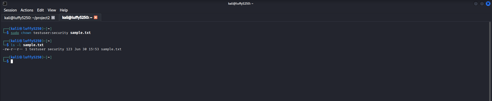

---

## 3. Display Default File Permissions

### Command

```bash

umask

```

### Description

I can see the default permission mask used when I create files and directories. This is how I do it. I use the command umask to see the default permission mask.

### Screenshot

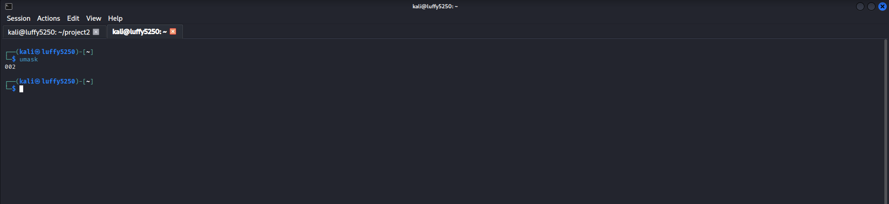

---

## 4. Set a New Default Permission Mask

### Command

```bash

umask 022

```

### Description

I can set a default permission mask for new files and directories. This is how I do it. I use the command umask to set the default permission mask to 022.

### Screenshot

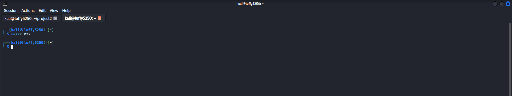

---

## 5. Display File Attributes

### Command

```bash

lsattr sample.txt

```

### Description

I can see the attributes assigned to the file sample.txt. This is how I do it. I use the command lsattr to see the attributes of sample.txt.

### Screenshot

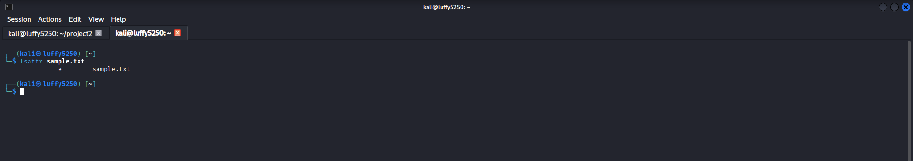

---

## 6. Make a File Immutable

### Command

```bash

sudo chattr +i sample.txt

```

### Description

I can make the file sample.txt immutable. This means it cannot be changed or deleted. This is how I do it. I use the command chattr to make sample.txt immutable.

### Screenshot

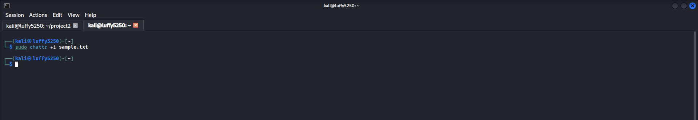

---

## 7. Remove Attribute

### Command

```bash

sudo chattr -i sample.txt

```

### Description

I can remove the immutable attribute from the file sample.txt. This is how I do it. I use the command chattr to remove the attribute from sample.txt.

### Screenshot

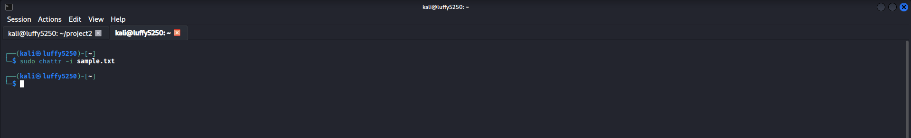

---

## 8. Display File Path Permissions

### Command

```bash

namei -l sample.txt

```

### Description

I can see the permissions of every directory in the path of the file sample.txt. This is how I do it. I use the command namei to see the permissions of every directory in the path of sample.txt.

### Screenshot

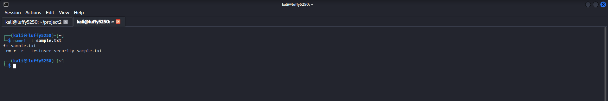

---

## 9. Set an Access Control List (ACL)

### Command

```bash

sudo setfacl -m u:testuser:rwx sample.txt

```

### Description

I can give testuser read write and execute permissions to the file sample.txt using an Access Control List. This is how I do it. I use the command setfacl to give testuser these permissions.

### Screenshot

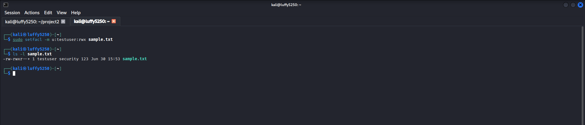

---

## 10. Display the Access Control List

### Command

```bash

getfacl sample.txt

```

### Description

I can see the Access Control List entries for the file sample.txt. This is how I do it. I use the command getfacl to see the Access Control List entries for sample.txt.

### Screenshot

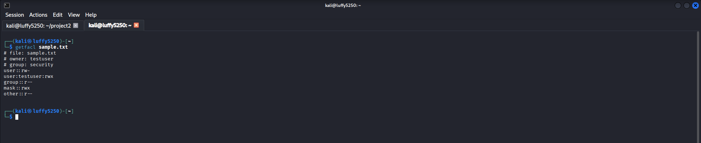

---
#  conclusion


In this part, I learned how to:

- Change the owner of a file using `chown`.
- Change both the owner and group of a file using `chown user:group`.
- View the default permission mask using `umask`.
- Set a new default permission mask using `umask 022`.
- Display file attributes using `lsattr`.
- Make a file immutable using `chattr +i`.
- Remove the immutable attribute using `chattr -i`.
- View file path permissions using `namei -l`.
- Grant file permissions using `setfacl`.
- Display Access Control Lists using `getfacl`.


----------------------------------------------------------------------------------------------------------------------------------------------------------------------------------------------------------------------------------------


# Part 4 – Managing Processes

## 1. Looking at All Running Processes

### Situation

My system is running slowly. I need to see what is going on before I can fix it. So I need to look at all the processes that are currently running.

### Command

```bash

ps aux

```

### What it Does

This command shows me information about all the processes that are running on my system. This helps me understand what is going on and what might be causing the problem.

### Screenshot

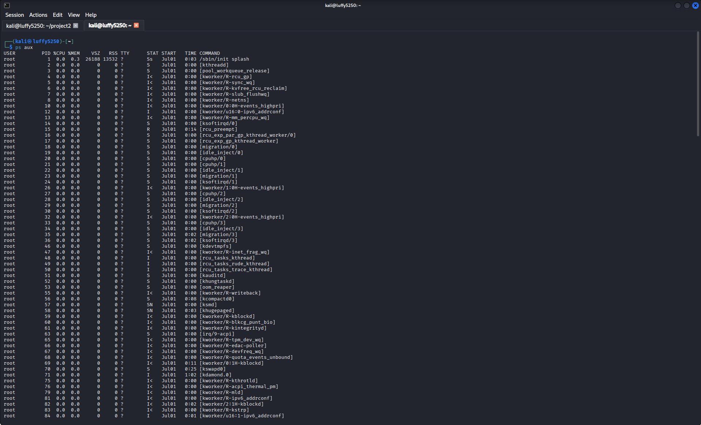

---

## 2. Looking at the Process Tree

### Situation

I want to know which processes started processes. This will help me understand how everything is connected.

### Command

```bash

pstree

```

### What it Does

This command shows me a tree of all the running processes. It is like a family tree. For processes. This helps me see which processes started processes.

### Screenshot

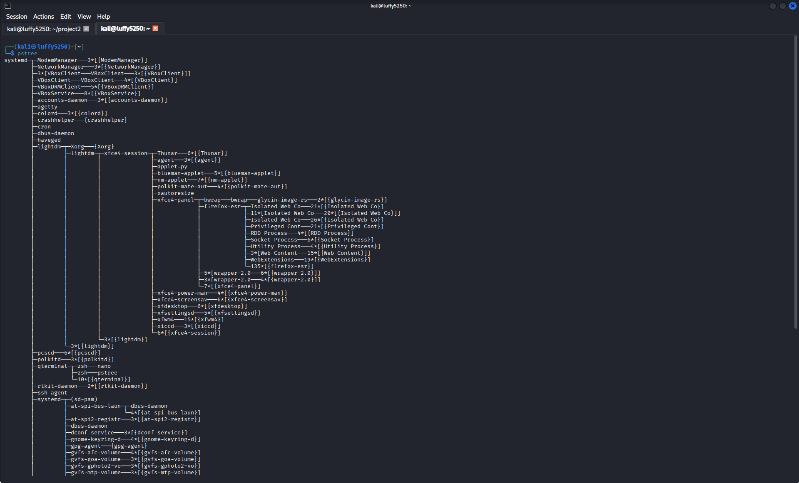

---

## 3. Finding a Process by Name

### Situation

I need to find the process ID of the Firefox browser. I do not know what the ID is. I know the name of the process.

### Command

```bash

firefox

```

### What it Does

This command searches for running processes by name and returns their process IDs. This is really useful when I know the name of the process but not the ID.

### Screenshot

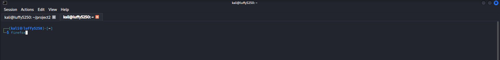

---

## 4. Finding the Process ID

### Situation

I want to know the exact process ID of the SSH service. I need this ID to do things with the process.

### Command

```bash

pidof ssh

```

### What it Does

This command shows me the process ID of the specified running program. This is really useful when I need to know the ID of a process.

### Screenshot

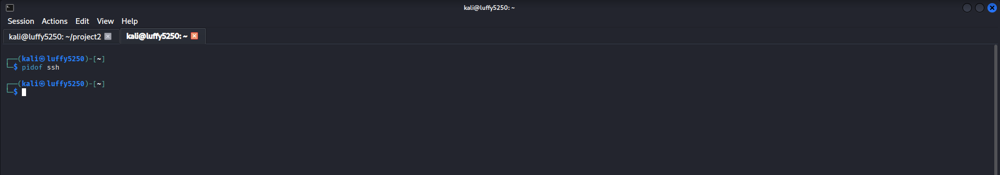

---

## 5. Stopping a Process

### Situation

A process has stopped responding. I need to stop it. This process is using up system resources. Needs to be stopped.

### Command

```bash

kill <PID>

```

### Example

```bash

kill 1234

```

### What it Does

This command stops a process using its process ID. This is really useful when a process is not responding and needs to be stopped.

### Screenshot

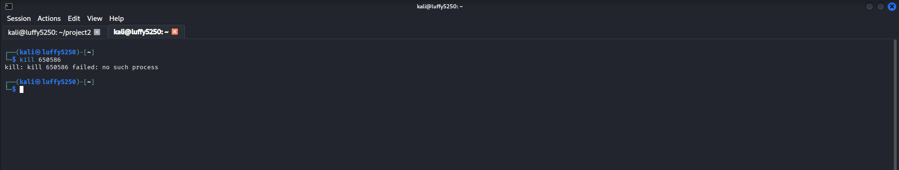

---

## 6. Killing a Process by Name

### Situation

of remembering the process ID I want to stop a process directly by its name. This is easier than remembering the ID.

### Command

```bash

pkill sleep

```

### What it Does

This command stops processes that match the specified name. This is really useful when I know the name of the process but not the ID.

### Screenshot

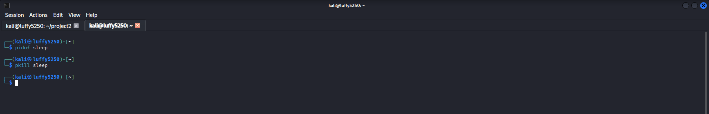

---

## 7. Killing All Instances of a Program

### Situation

Multiple instances of a program are. I need to stop all of them. This program is using up system resources. Needs to be stopped.

### Command

```bash

killall 

```

### What it Does

This command stops all running instances of the program. This is really useful when I need to stop all instances of a program.

### Screenshot

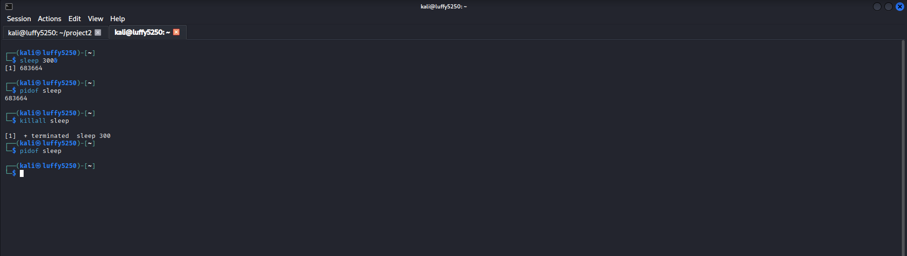

---

## 8. Starting a Process with Lower Priority

### Situation

I have a task that uses a lot of CPU. I do not want it to affect system performance. So I need to start the process with a priority.

### Command

```bash

nice - n 10 sleep 300

```

### What it Does

This command starts a process with a CPU scheduling priority. This means that the process will not use much CPU and will not affect system performance as much.

### Screenshot

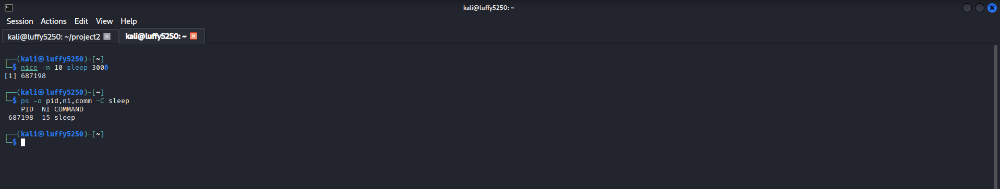

---

## 9. Changing Process Priority

### Situation

A running process needs its priority changed. I need to adjust the priority so that the process uses less CPU.

### Command

```bash

renice 5 -p <PID>

```

### Example

```bash

renice 5 -p 1234

```

### What it Does

This command changes the scheduling priority of an existing process. This means that I can adjust the priority of a process that is already running.

### Screenshot

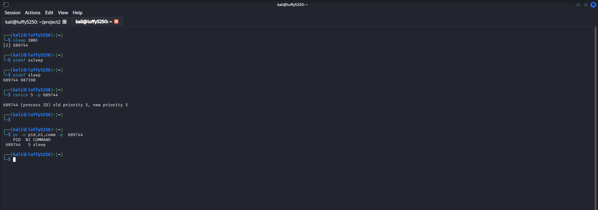

---

## 10. Looking at Background Jobs

### Situation

I started a command in the background. I want to check its status. I need to see if the command is still running or if it has finished.

### Command

```bash

jobs

```

### What it Does

This command shows me jobs that are running in the shell session. This means that I can see what commands are currently running in the background.

### Screenshot

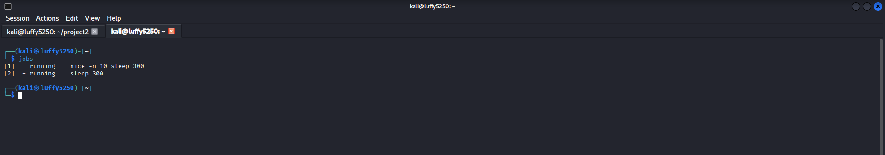

---

# conclusion

In this part I learned how to manage processes. I learned how to:

- look at all running processes using `ps aux` command.

- display processes in a tree structure using `pstree` command.

- search for processes using `command.

- find a process ID using `pidof` command.

- stop a process using `kill` command.

- kill processes by name using `pkill` command.

- stop all instances of a program using `killall` command.

- start processes, with a custom priority using `nice` command.

- modify process priority using `renice` command.

- monitor background jobs using `jobs` command. Managing processes is a part of using a system. It helps me understand what is going on and how to fix problems.


-----------------------------------------------------------------------------------------------------------------------------------------------------------------------------------------------------------------------------------

# Part 5 – Service Management

## 1. Check Service Status

### Scenario

The web server is not working. I need to see if the apache2 service is running.

### Command

```bash

systemctl status apache2

```

### Description

This command shows me if the apache2 service is running or not.

### Screenshot

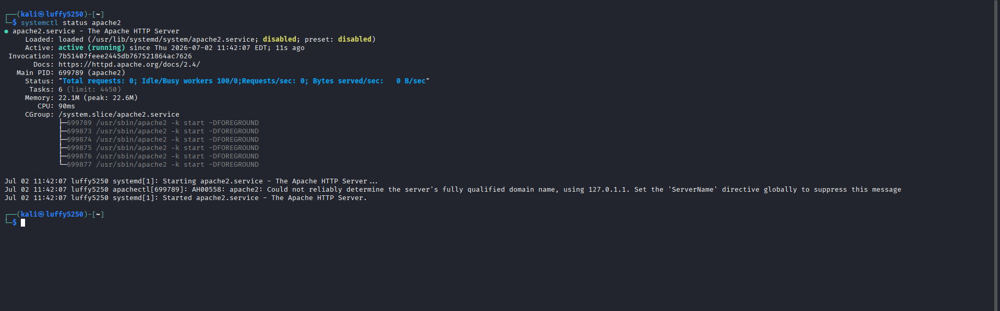

---

## 2. Start a Service

### Scenario

The apache2 web server is stopped. I need to start it

### Command

```bash

sudo systemctl start apache2

```

### Description

This command starts the apache2 service away.

### Screenshot

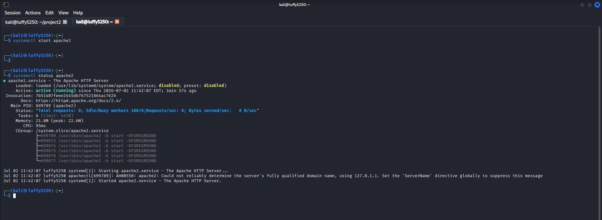

---

## 3. Stop a Service

### Scenario

A service is using many resources. I need to stop the apache2 service.

### Command

```bash

sudo systemctl stop apache2

```

### Description

This command stops the apache2 service.

### Screenshot

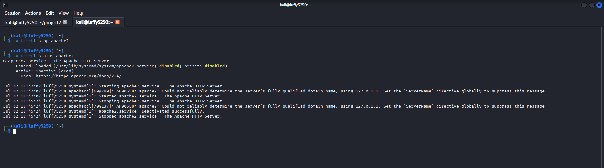

---

## 4. Restart a Service

### Scenario

I changed the apache2 service configuration. I need to apply these changes.

### Command

```bash

sudo systemctl restart apache2

```

### Description

This command stops. Then starts the apache2 service again.

### Screenshot

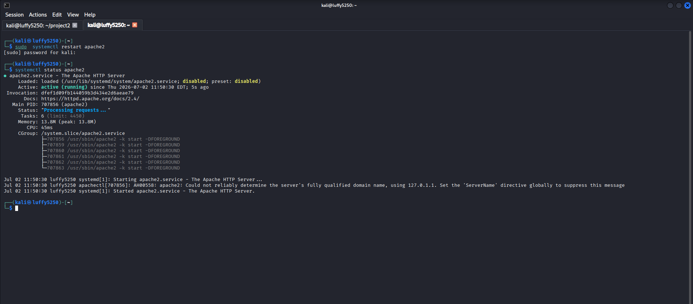

---

## 5. Enable a Service at Boot

### Scenario

I want the apache2 web server to start automatically when the system starts.

### Command

```bash

sudo systemctl enable apache2

```

### Description

This command makes the apache2 service start automatically when the system boots up.

### Screenshot

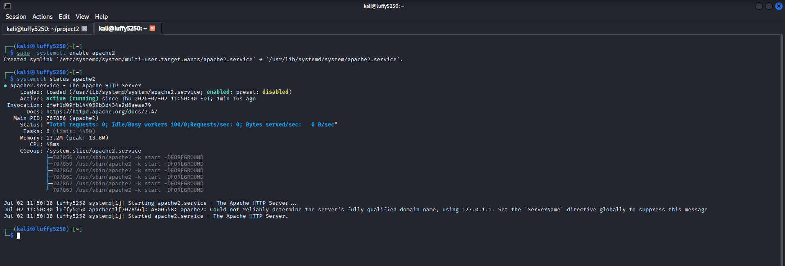

---

## 6. Disable a Service at Boot

### Scenario

I do not want a service to start automatically during boot.

### Command

```bash

sudo systemctl disable apache2

```

### Description

This command prevents the apache2 service from starting during boot.

### Screenshot

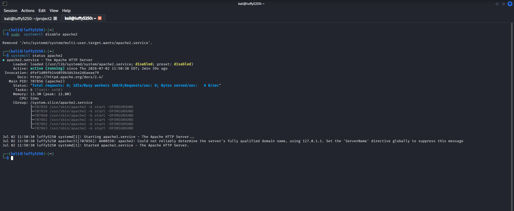

---

## 7. Check Whether a Service is

### Scenario

I need to know if the apache2 service is running now.

### Command

```bash

systemctl is-active apache2

```

### Description

This command tells me if the apache2 service is running or not.

### Screenshot

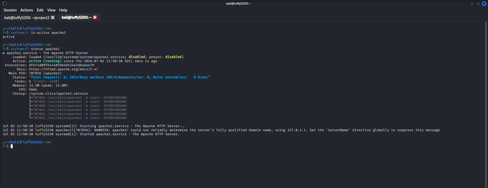

---

## 8. View Service Logs

### Scenario

The apache2 service did not start. I need to see what went wrong.

### Command

```bash

journalctl -u apache2

```

### Description

This command shows me the logs, for the apache2 service.

### Screenshot

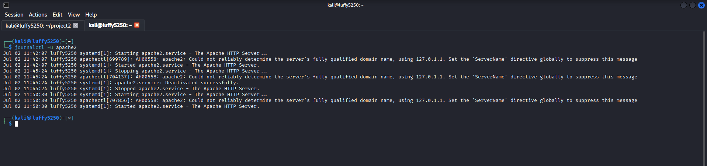

---

## 9. List Failed Services

### Scenario

I want to see which services failed to start when the system booted up.

### Command

```bash

systemctl --failed

```

### Description

This command shows me all the services that failed to start.

### Screenshot

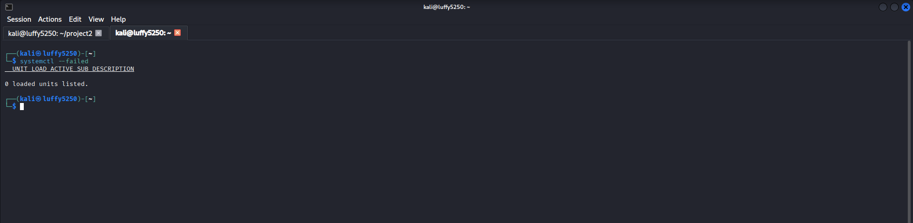

---

# conclusion

In this part I learned how to:

- Check the apache2 service status using `systemctl status`.

- Start the apache2 service using `systemctl start`.

- Stop the apache2 service using `systemctl stop`.

- Restart the apache2 service using `systemctl restart`.

- Enable the apache2 service to start using `systemctl enable`.

- Disable the apache2 service from starting automatically using `systemctl disable`.

- Check if the apache2 service is running using `systemctl is-active`.

- View the apache2 service logs using `journalctl`.

- List all the failed services using `systemctl --failed`.


----------------------------------------------------------------------------------------------------------------------------------------------------------------------------------------------------------------------------------

# Part 6 – Storage Management

## 1. Display Block Devices

### Scenario

When I am working with Storage Management I need to see all the Storage Devices that're available. This is important because I have to identify all the Storage Devices before I can create a partition or fix a problem with a disk.

### Command

```bash

lsblk

```

### Description

The `lsblk` command is used for Storage Management. It shows me information about all the block devices, including disks and partitions. This is very useful for Storage Management.

### Screenshot

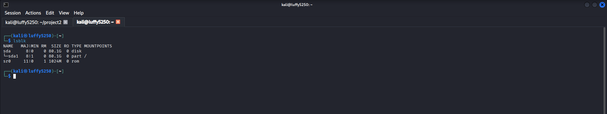

---

## 2. Display Filesystem Information

### Scenario

I need to know what type of filesystem is being used by the Storage Devices and what the UUID is. This information is important for Storage Management.

### Command

```bash

lsblk -f

```

### Description

The `lsblk -f` command is used for Storage Management. It shows me the block devices, the type of filesystem the UUID and where they are mounted. This is useful for Storage Management because it gives me all the information I need about the Storage Devices.

### Screenshot

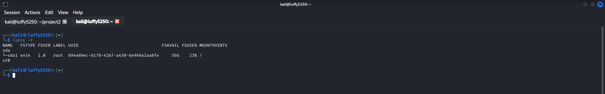

---

## 3. Display Filesystem UUIDs

### Scenario

As a system administrator I need to know the UUID of a partition before I can edit the `/etc/fstab` file. This is a part of Storage Management.

### Command

```bash

sudo blkid

```

### Description

The `blkid` command is used for Storage Management. It shows me the UUID, the type of filesystem and the labels of the Storage Devices. This is useful for Storage Management because it gives me the information I need to work with the Storage Devices.

### Screenshot

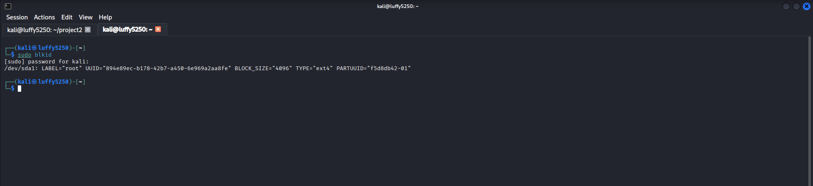

---

## 4. Display Mounted Filesystems

### Scenario

I need to see which filesystems are currently being used. This is important for Storage Management because I need to know what is going on with the Storage Devices.

### Command

```bash

findmnt

```

### Description

The `findmnt` command is used for Storage Management. It shows me all the mounted filesystems in a tree structure. This is useful for Storage Management because it gives me a picture of how the Storage Devices are being used.

### Screenshot

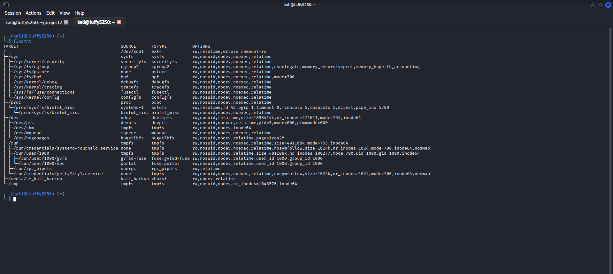

---

## 5. Display Disk Usage by Filesystem Type

### Scenario

I want to see how much space is available on the disks and what type of filesystem is being used. This is a part of Storage Management.

### Command

```bash

df -Th

```

### Description

The `df -Th` command is used for Storage Management. It shows me how much space is being used by the disks and what type of filesystem is being used. This is useful for Storage Management because it gives me the information I need to manage the Storage Devices.

### Screenshot

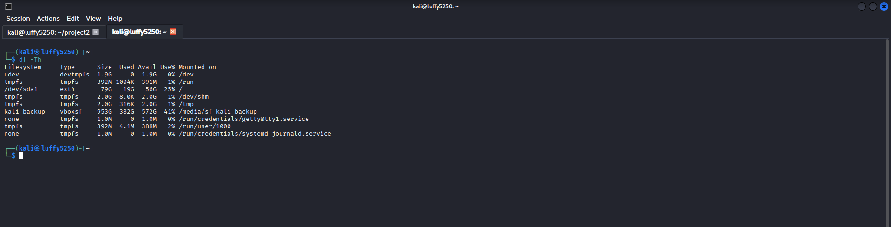

---

## 6. Display File and Directory Sizes

### Scenario

One of the directories is using much space and I need to find out which files are the biggest. This is a part of Storage Management.

### Command

```bash

du -ah

```

### Description

The `du -ah` command is used for Storage Management. It shows me the size of all the files and directories. This is useful for Storage Management because it helps me identify which files are using the space.

### Screenshot

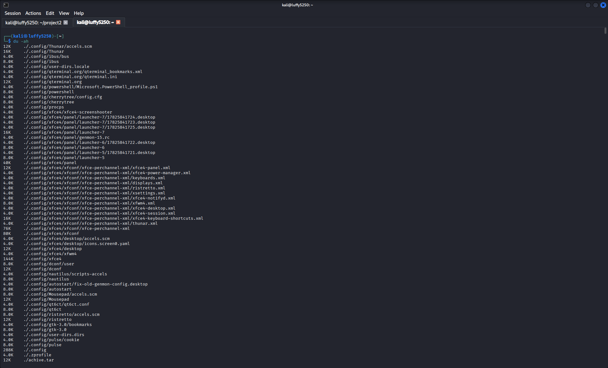

---

## 7. Display Mounted Devices

### Scenario

Before I remove a USB drive I need to make sure it is not being used. This is a part of Storage Management.

### Command

```bash

mount

```

### Description

The `mount` command is used for Storage Management. It shows me all the mounted filesystems and where they are mounted. This is useful for Storage Management because it helps me avoid removing a device that is still being used.

### Screenshot

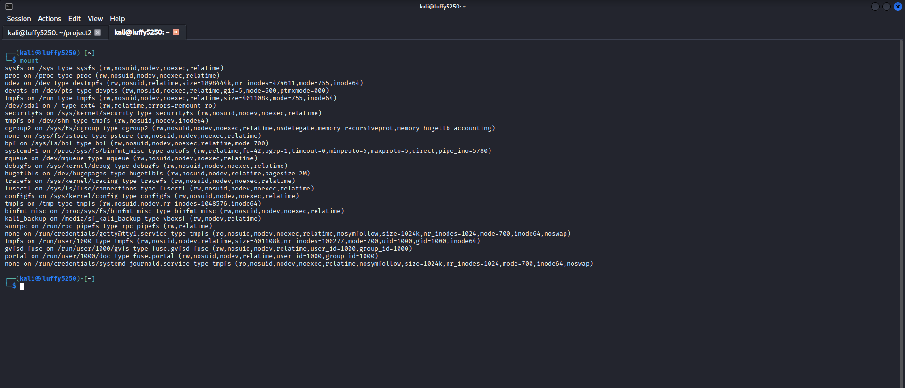

---

## 8. Display Partition Table

### Scenario

Before I create or modify partitions I need to see how the disks are currently set up. This is a part of Storage Management.

### Command

```bash

sudo fdisk -l

```

### Description

The `fdisk -l` command is used for Storage Management. It shows me all the available disks and their partition tables. This is useful for Storage Management because it gives me the information I need to work with the partitions.

### Screenshot

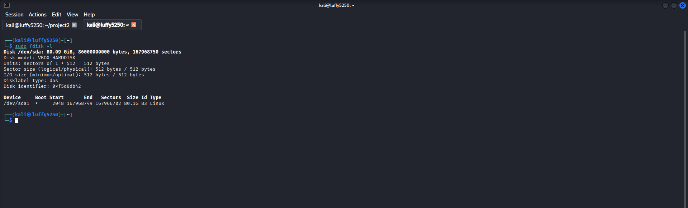

---

## 9. Check Filesystem Health (Read-

### Scenario

Before I do any maintenance I need to check the filesystem to make sure it is okay. This is a part of Storage Management.

### Command

```bash

sudo fsck -N /dev/sda1

```

### Description

The `fsck -N` command is used for Storage Management. It shows me what would happen if I checked the filesystem without actually doing anything. This is useful, for Storage Management because it helps me avoid making any mistakes.

### Screenshot


---

# conclusion

In this part I learned how to use the following Storage Management commands:

- `lsblk` to view block devices.

- `lsblk -f` to display information.

- `blkid` to view partition UUIDs.

- `findmnt` to display mounted filesystems.

- `df -Th` to check disk usage.

- `du -ah` to analyze file and directory sizes.

- `mount` to view mounted devices.

- `fdisk -l` to inspect partition tables.

- `fsck -N` to preview filesystem checks. I learned about all these Storage Management commands. Storage Management is very important. I will use these Storage Management commands to manage the Storage Devices.


---------------------------------------------------------------------------------------------------------------------------------------------------------------------------------------------------------------------------------


# Part 7 – Advanced Package Management

## 1. List Installed Packages

### Scenario

When I am troubleshooting or auditing a system the first thing I need to do is see all the packages that are installed on the system. This is because I need to know what is installed.

### Command

```bash

dpkg -l

```

### Description

The dpkg -l command displays a list of all the packages that are installed on the system. This is really helpful when I need to see what is installed.

### Screenshot

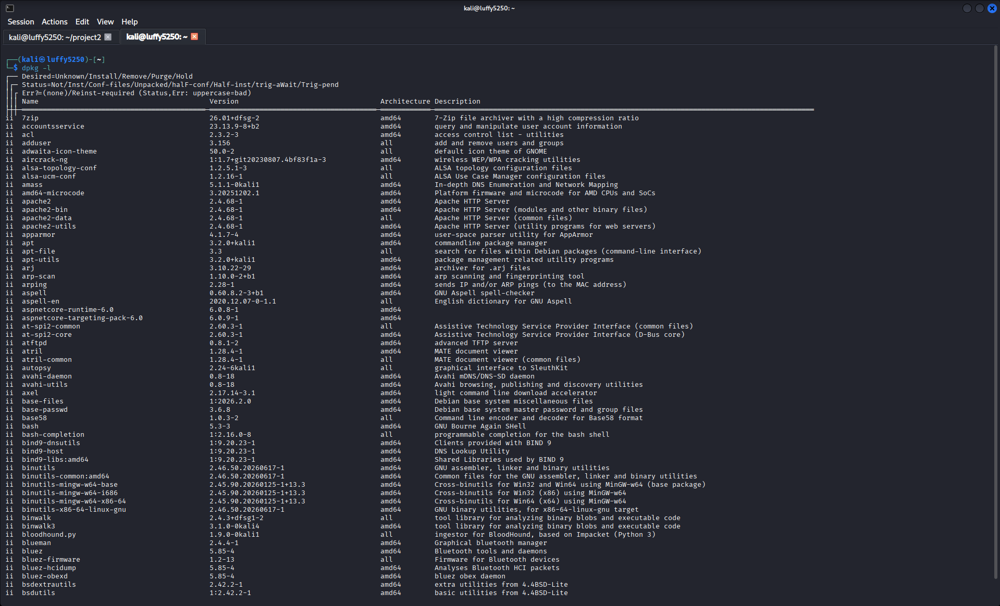

---

## 2. Display Detailed Package Information

### Scenario

Sometimes I need to know more about a package that is installed on the system. For example I might want to know the version of the package or the description of the package.

### Command

```bash

dpkg -s openssh-server

```

### Description

The dpkg -s command displays information about the package that I specify. In this case I am looking at the openssh-server package.

### Screenshot

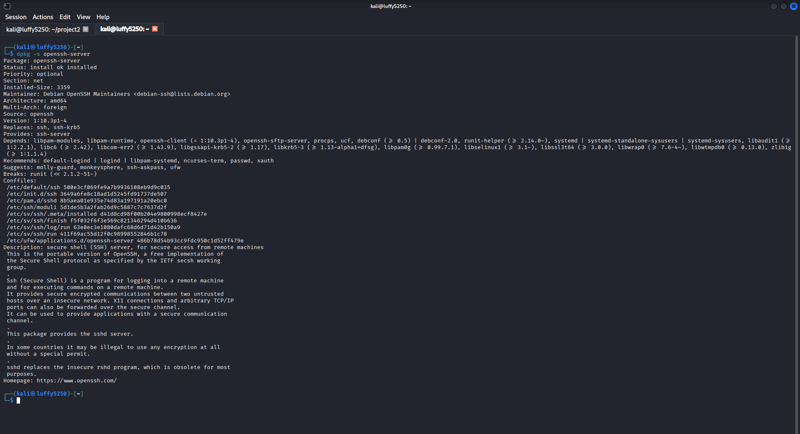

---

## 3. Find Which Package Owns a File

### Scenario

I might find a file on the system. Wonder which package installed it. This can be helpful when I am trying to figure out what a file does.

### Command

```bash

dpkg -S /bin/ls

```

### Description

The dpkg -S command tells me which package owns the file that I specify. In this case I am looking at the /bin/ file.

### Screenshot

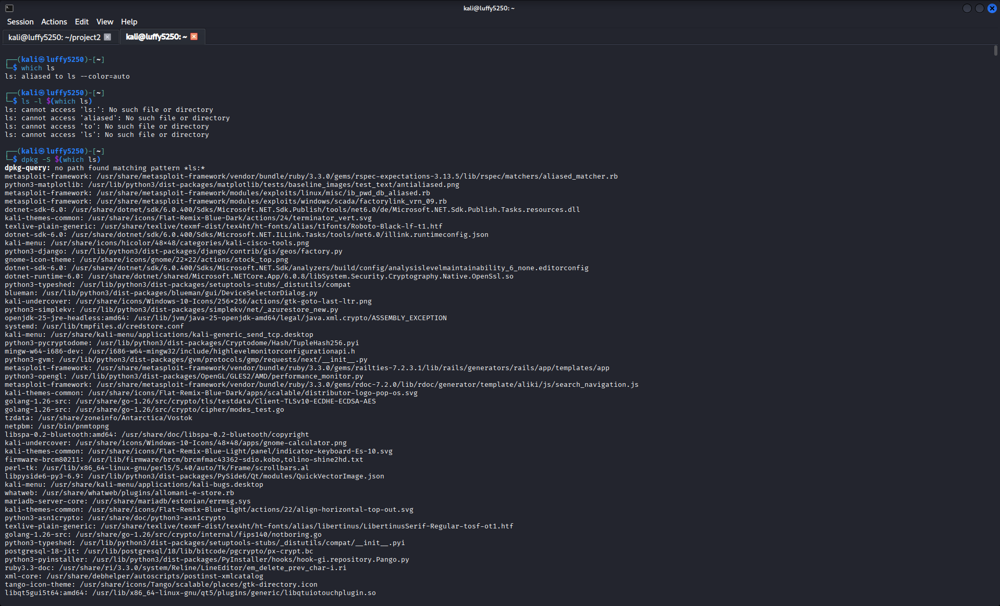

---

## 4. View Package Dependencies

### Scenario

Before I install a package I want to know which packages it depends on. This is because I need to make sure that all the dependencies are installed.

### Command

```bash

apt-cache depends nmap

```

### Description

The apt-cache depends command displays the dependencies of the package that I specify. In this case I am looking at the nmap package.

### Screenshot

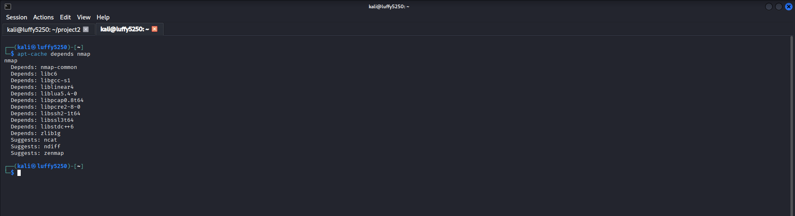

---

## 5. View Reverse Dependencies

### Scenario

Before I remove a package I want to check which other packages depend on it. This is because I do not want to remove a package that other packages need.

### Command

```bash

apt-cache rdepends nmap

```

### Description

The cache rdepends command displays the packages that depend on the package that I specify. In this case I am looking at the nmap package.

### Screenshot

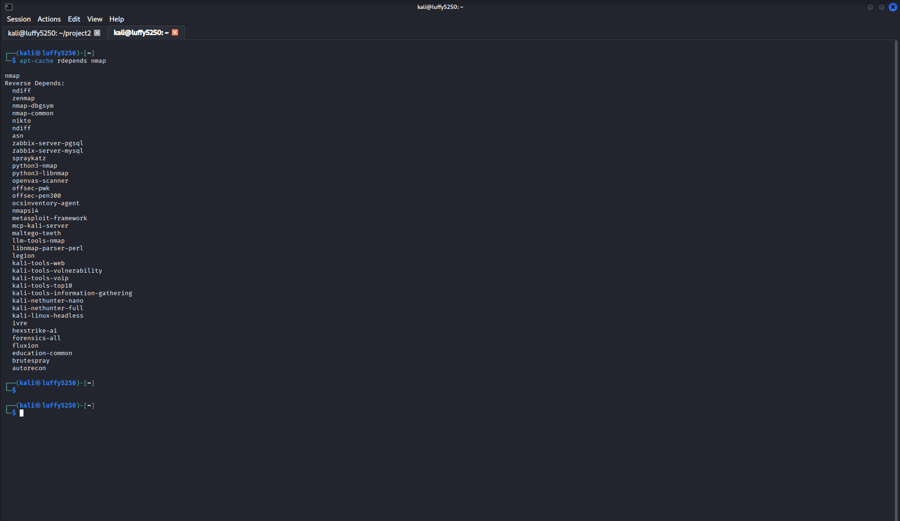

---

## 6. Display Package Policy

### Scenario

I want to verify the version of a package that is installed on the system and the versions that are available in the repository.

### Command

```bash

apt-cache policy nmap

```

### Description

The apt-cache policy command displays the version of the package that is installed and the versions that are available. In this case I am looking at the nmap package.

### Screenshot

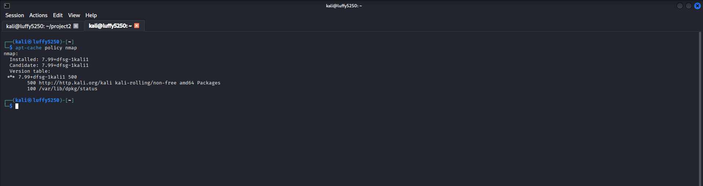

---

## 7. List Manually Installed Packages

### Scenario

I need to distinguish between the packages that I installed manually and the packages that were installed automatically as dependencies.

### Command

```bash

mark showmanual

```

### Description

The apt-mark showmanual command displays the packages that I installed manually.

### Screenshot

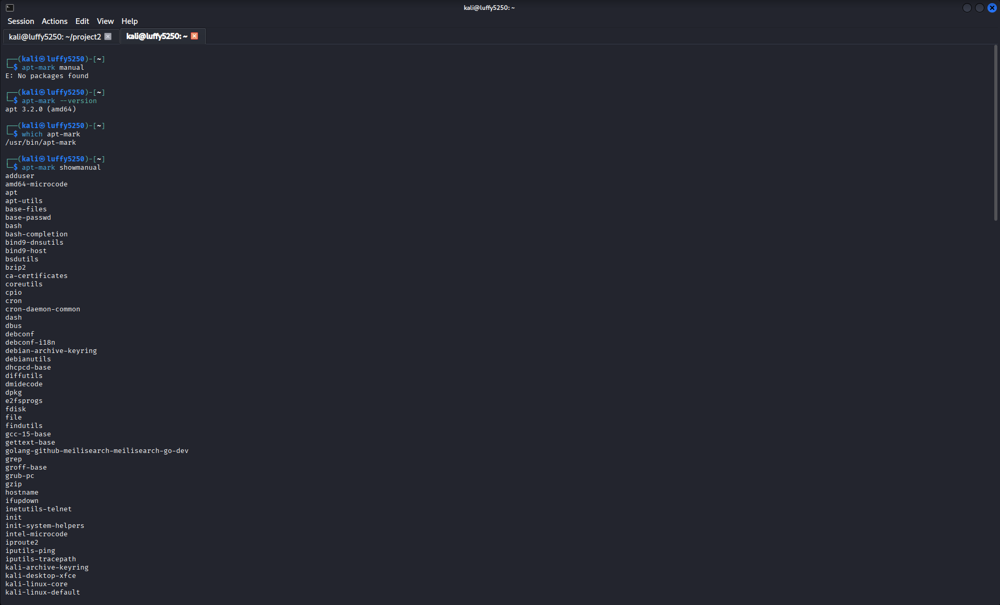

---

## 8. List Automatically Installed Packages

### Scenario

I want to identify the packages that were installed automatically as dependencies.

### Command

```bash

apt-mark showauto

```

### Description

The apt-mark showauto command displays the packages that were installed automatically.

### Screenshot

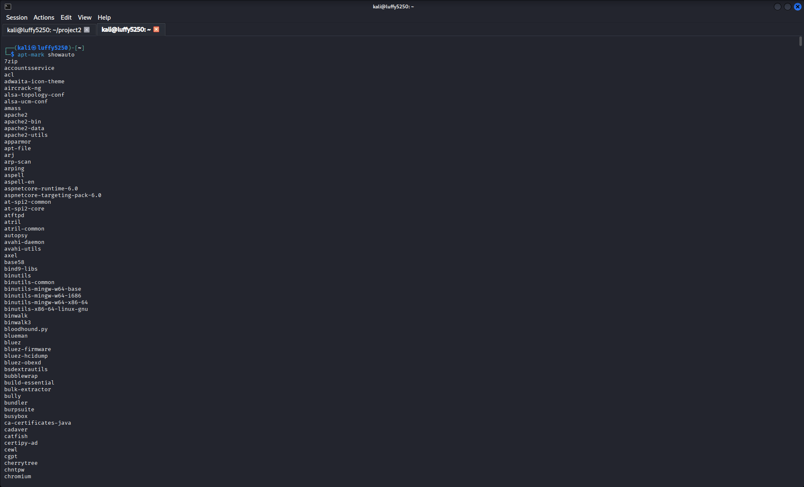

---

## 9. List Upgradable Packages

### Scenario

Before I update the system I want to check which packages have updates.

### Command

```bash

list --upgradable

```

### Description

The apt list --upgradable command displays all the packages that can be upgraded.

### Screenshot

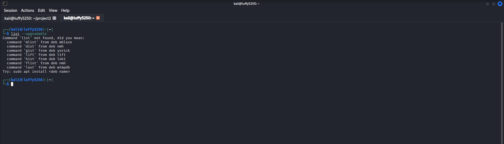

---

# Conclusion

In this part, I learned how to:

- List installed packages using `dpkg -l`.
- View package details using `dpkg -s`.
- Identify which package owns a file using `dpkg -S`.
- View package dependencies using `apt-cache depends`.
- View reverse dependencies using `apt-cache rdepends`.
- Check package versions using `apt-cache policy`.
- List manually installed packages using `apt-mark showmanual`.
- List automatically installed packages using `apt-mark showauto`.
- Display packages available for upgrade using `apt list --upgradable`.


---------------------------------------------------------------------------------------------------------------------------------------------------------------------------------------------------------------------------------------------------


# Part 8 – Job Scheduling

## 1. View Current Users Cron Jobs

### Scenario

I want to see what cron jobs the current user has set up. Before I create a scheduled task I need to check if the current user already has some cron jobs configured.

### Command

```bash

crontab -l

```

### Description

This command shows me all the cron jobs that are set up for the user. It is like a list of all the tasks that are scheduled to run

### Screenshot

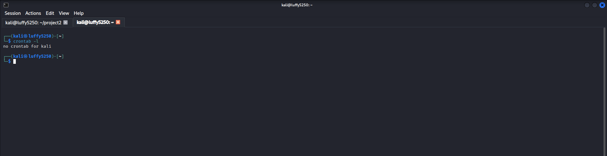

---

## 2. Edit Cron Jobs

### Scenario

Lets say I want to schedule a script to run every day. I need to edit the cron jobs to add this task.

### Command

```bash

crontab -e

```

### Description

This command opens up the cron table for the user and I can edit it to add new tasks or change existing ones. It is like a text editor. For cron jobs.

### Screenshot

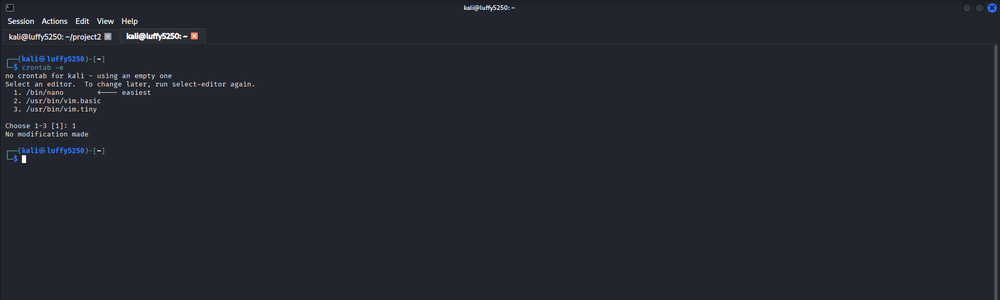

---

## 3. Schedule a One-Time Task

### Scenario

I have a maintenance script that I need to run at a specific time. I can use the `at` service to schedule this task.

### Command

```bash

echo "date > /tmp/job.txt" at now + 2 minutes

```

### Description

This command schedules a one-time task using the `at` service. The task will run in 2 minutes. It will write the current date to a file called job.txt.

### Screenshot

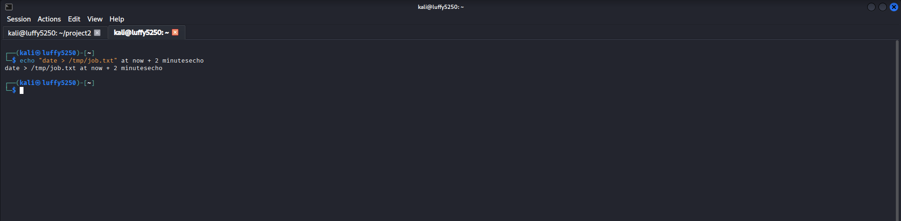

---

## 4. View Pending One-Time Jobs

### Scenario

After I schedule a one-time task I want to make sure it has been added successfully. I can use the `atq` command to view all the pending jobs.

### Command

```bash

atq

```

### Description

This command lists all the pending `at` jobs. I can see the job number, the time it will run and the command that will be executed.

### Screenshot

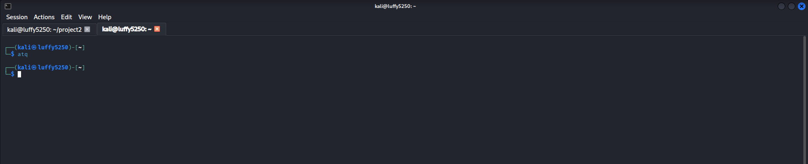

---

## 5. Remove a Scheduled Job

### Scenario

Lets say I have a scheduled job that I no longer need. I can remove it using the `atrm` command.

### Command

```bash

atrm 1

```

### Description

This command removes the specified `at` job. I need to replace `1` with the job number that I got from the `atq` command.

### Screenshot

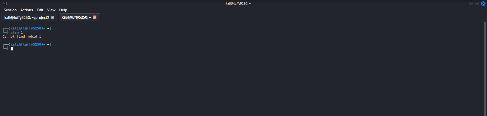

---

## 6. Pause Command Execution

### Scenario

Sometimes I need to delay a script before it executes the command. I can use the `sleep` command to pause the execution.

### Command

```bash

sleep 10

```

### Description

This command pauses the execution for 10 seconds. It is, like a timeout. I can specify how long I want to wait.

### Screenshot

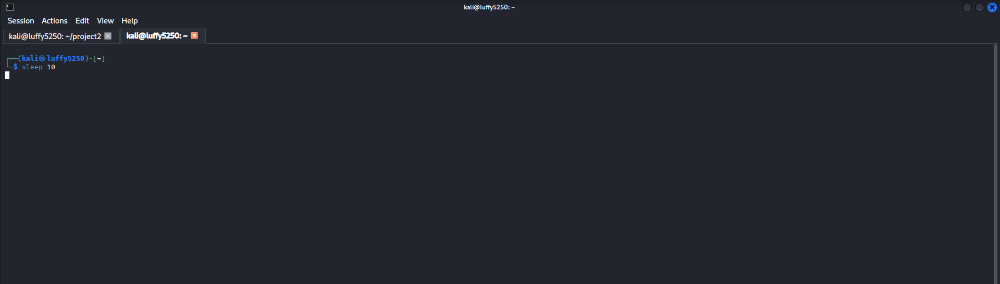

---

## 7. Monitor a Command

### Scenario

I am troubleshooting an issue and I need to monitor the disk usage every 5 seconds. I can use the `watch` command to execute a command

### Command

```bash

watch df -h

```

### Description

This command executes the `df -h` command repeatedly. It updates the output every 2 seconds. I can see the disk usage and it helps me to troubleshoot the issue.

### Screenshot

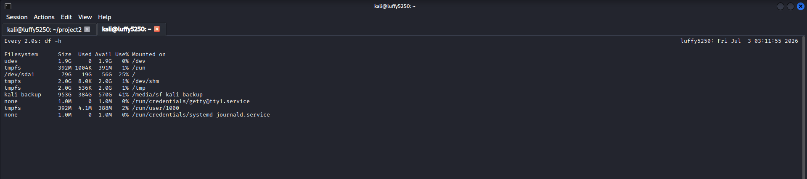

---

## 8. Measure Command Execution Time

### Scenario

I want to know how long a command takes to execute. I can use the `time` command to measure the execution time.

### Command

```bash

time ls -R

```

### Description

This command measures the execution time of the `ls -R` command. It shows me how long it took to execute the command. It helps me to optimize my scripts.

### Screenshot

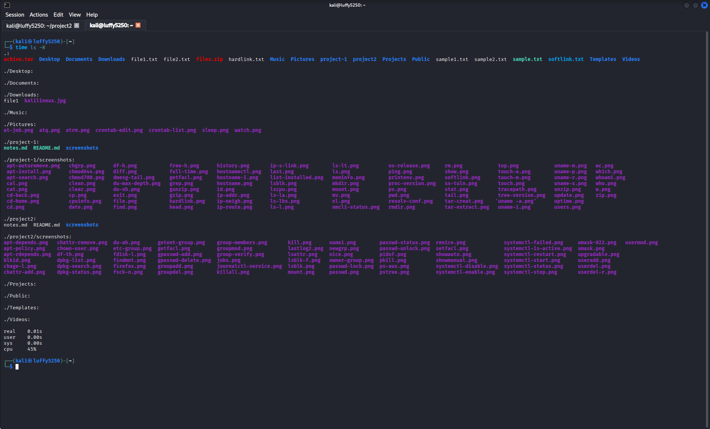

---

## 9. Limit Command Runtime

### Scenario

I have a command that might run indefinitely. I want to prevent it from running too long. I can use the `timeout` command to limit the runtime.

### Command

```bash

timeout 5 ping google.com

```

### Description

This command stops the `ping google.com` command after 5 seconds. It prevents the command from running and it helps me to avoid wasting system resources.

### Screenshot

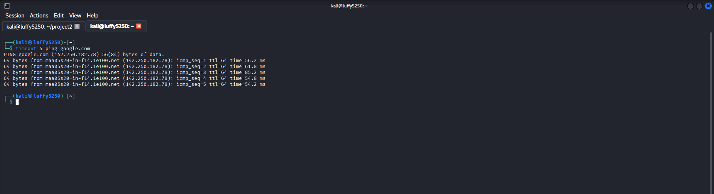

---

# conclusion

In this part I learned how to use cron jobs and other commands to schedule tasks and manage command execution. I learned how to:

- View scheduled cron jobs using `crontab -l` command.

- Create or edit cron jobs using `crontab -e` command.

- Schedule one-time tasks using `at` command.

- View pending scheduled jobs using `atq` command.

- Remove scheduled jobs using `command.

- Pause command execution using `sleep` command.

- Continuously monitor command output using `watch` command.

- Measure command execution time using `time` command.

- Limit command runtime using `timeout` command. I can use these commands to automate tasks and manage system resources.


-----------------------------------------------------------------------------------------------------------------------------------------------------------------------------------------------------------------------------------


# Part 9 – System Logs & Monitoring

## 1. View Recent Boot LogsC

### Scenario

When the system restarts I need to see what happened when it started up.

### Command

```bash

journalctl -b

```

### Description

This command shows me the logs from the time the system booted up.

### Screenshot

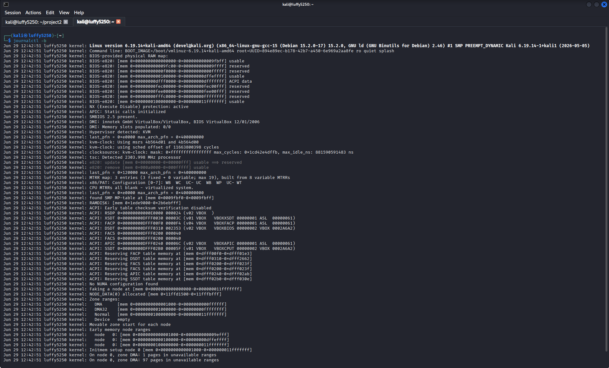

---

## 2. View Kernel Messages with Human- Timestamps

### Scenario

I want to check what happened with the hardware or drivers when I connected a new device.

### Command

```bash

dmesg -T

```

### Description

This command shows me the kernel messages with the date and time in a way that's easy to read.

### Screenshot

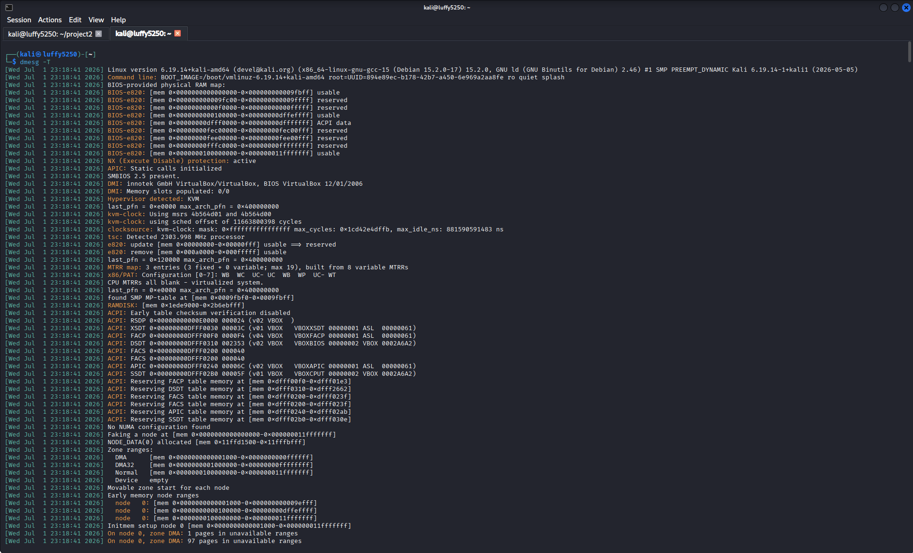

---

## 3. Display Authentication Log

### Scenario

I need to review what happened with logins. When someone used sudo.

### Command

```bash

sudo cat /var/log/auth.log

```

### Description

This command shows me the log of when people logged in and used sudo.

### Screenshot


>  **Note:** If `/var/log/auth.log` does not exist on my Kali version I can use:

>

> ```bash

> journalctl. Grep sudo

> ```

---

## 4. View Boot History

### Scenario

I want to check when the system booted up before to help me fix a problem.

### Command

```bash

journalctl --list-boots

```

### Description

This command shows me a list of when the system booted up

### Screenshot

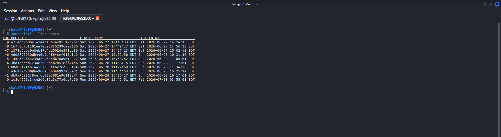

---

## 5. View Disk Usage of System Logs

### Scenario

I need to check how space the system logs are taking up.

### Command

```bash

journalctl --disk-usage

```

### Description

This command tells me how space the system journal is using.

### Screenshot

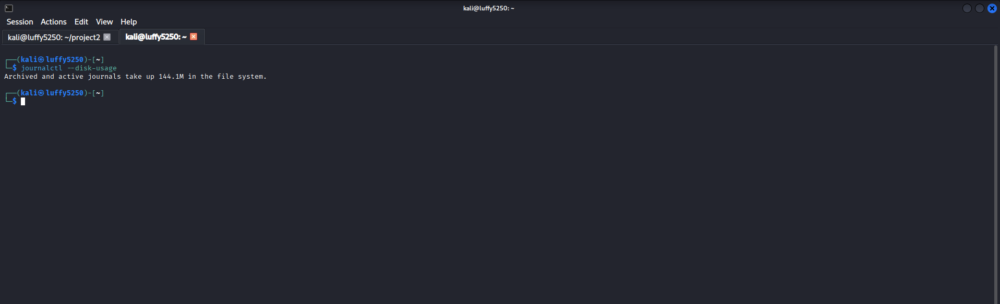

---

## 6. Display Recent Sudo Commands

### Scenario

I want to see what administrators have been doing with sudo.

### Command

```bash

journalctl | grep sudo

```

### Description

This command searches the system logs for when someone used sudo.

### Screenshot

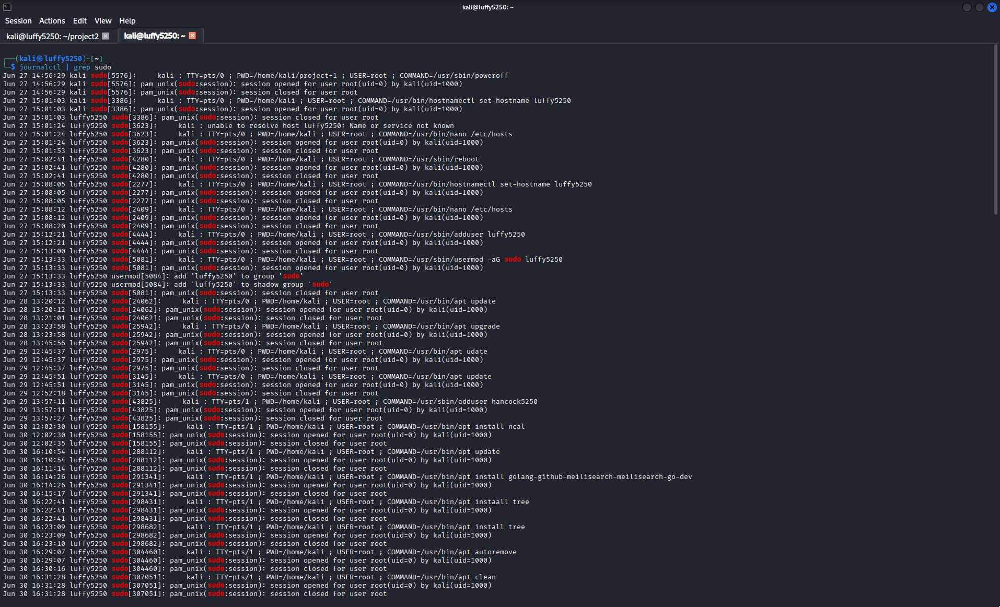

---

## 7. Display SSH Events

### Scenario

I need to check who has been trying to log in with SSH.

### Command

```bash

journalctl | grep ssh

```

### Description

This command searches the system logs for SSH events.

### Screenshot

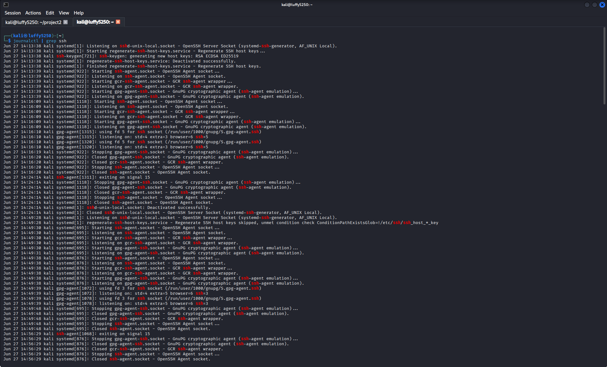

---

## 8. Display System Journal by Priority

### Scenario

I only want to see the warning and error messages when I am trying to fix a problem.

### Command

```bash

journalctl -p warning

```

### Description

This command shows me the journal entries that're warnings or errors.

### Screenshot

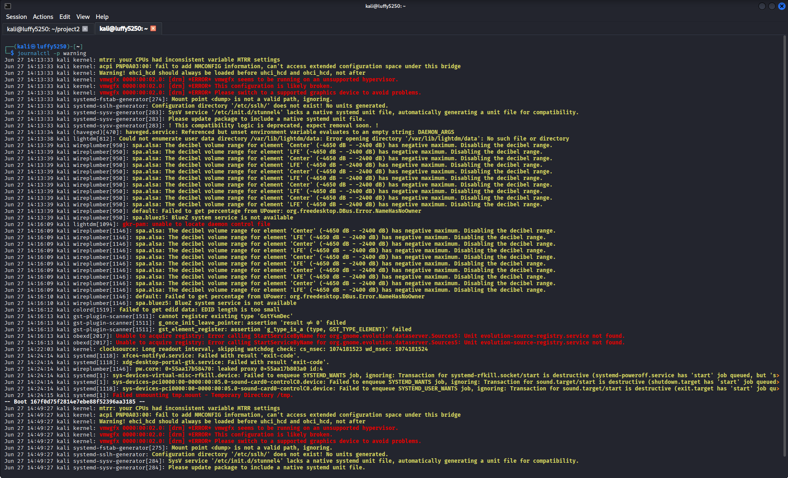

---

# Conclusion

In this part, I learned how to:

- View logs from the current boot using `journalctl -b`.
- Display kernel messages with readable timestamps using `dmesg -T`.
- Review authentication logs.
- View previous system boots.
- Check journal disk usage.
- Search logs for sudo activity.
- Search logs for SSH events.
- Filter logs by priority using `journalctl -p`.


-------------------------------------------------------------------------------------------------------------------------------------------------------------------------------------------------------


# Part 10 – Project Summary & Key Learnings

## Project Overview

This project was about Linux Administration using Kali Linux. I did lots of common system administration tasks that Linux administrators and entry-level SOC Analysts do.

The project covered things like user and group management file permissions and process monitoring.

## Skills Acquired

## User Management

* I. Managed Linux users.

* I set passwords for users.

* I changed user accounts.

* I managed password rules.

## Group Management

* I. Managed groups.

* I. Removed users from groups.

* I. Deleted groups.

* I checked group membership.

## File. Permissions

* I changed who owned files.

* I managed file permissions.

* I set default permissions using `umask`.

* I worked with Access Control Lists (ACLs).

* I protected files so they couldn't be changed.

## Process Management

* I found out what processes were running.

* I found the IDs of processes.

* I stopped processes safely.

* I changed how important processes were.

* I managed jobs that ran in the background.

## Service Management

* I started, stopped and restarted services.

* I made services start or not start when the computer boots.

* I checked the status of services.

* I looked at service logs.

## Storage Management

* I looked at storage devices.

* I checked how much space was used on filesystems.

* I viewed mounted filesystems.

* I checked partition information.

## Package Management

* I checked what packages were installed.

* I looked at package information.

* I checked package dependencies.

* I found out what updates were available.

## Job Scheduling

* I worked with Cron jobs.

* I scheduled tasks to run once.

* I watched commands that were running.

* I measured how long tasks took.

## System. Monitoring

* I looked at authentication logs.

* I checked kernel messages.

* I investigated boot logs.

* I filtered system journal entries.

## Tools Used

* Kali Linux

* Bash

* systemd

* APT Package Manager

* Git

* GitHub

* VirtualBox

## What I Learned

I got hands-on experience with Linux administration by doing tasks that Linux administrators do.

I learned how to:

* Manage users and groups.

* Set file permissions.

* Watch system processes.

* Manage Linux services.

* Work with storage devices and filesystems.

* Manage packages.

* Automate tasks using scheduling tools.

* Investigate system logs to fix problems.

## Career Relevance

These Linux administration skills are useful for:

* SOC Analyst (L1)

* Linux System Administrator

* Security Operations

* Incident Response

## Final

This project helped me understand Linux administration through practice and documentation. It gave me hands-on experience with administrative tasks that are important, for cybersecurity operations and SOC analysis.

The knowledge I gained will help me with work involving Linux servers, security monitoring log analysis and incident investigation.
